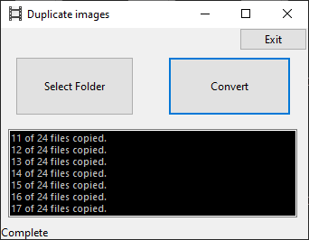

# frameDuplicator
Tool to double the number of frames of an animation.

When I animate, I tend to animate at 12fps. I can point this tool at a folder full of images and it will duplicate each frame and copy the new image sequence to a subfolder called 'twos'. Allowing me to edit the new sequence at 24fps on twos.

It's a clunky tool, with no error handling, which assumes all images in a folder are part of the same sequence.

[Download the Windows tool here](https://github.com/cyberfilth/frameDuplicator/releases/download/v2.0/FrameDuplicator.zip)

